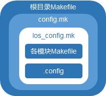
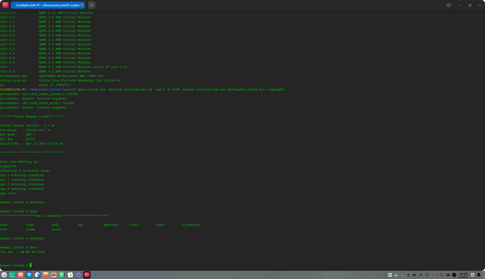

## 摘要

---

本文为 Rage_of_dUST 小组的关于使用 Rust 改写 LiteOS 内存管理单元的可行性报告，文章先介绍了LiteOS 在Linux下的编译方法，并讨论了LiteOS 的代码树结构，分析了各个代码模块的组成和功能，详细阐述了 LiteOS 的内核代码组成，并对每个可能改写的模块改写时的优点和挑战进行了分析和评价。然后对 Rust 和 C 的相互调用的实现方式进行了阐述和说明，并讨论了实现正常编译的可行性，而且挑选了其中几个小的代码块进行了试改写，验证这样改写的可行性，最后对该项目的创新点进行的简要概述，并且对今后的工作开展和进度控制进行了展望。

## 理论依据

---

### LiteOS 在 Linux 及 Windows下的编译方法

---

#### 编译框架简介

Huawei LiteOS使用Kconfig文件配置系统，基于GCC/Makefile实现组件化编译。 

<center>


图1：LiteOS编译框架

</center>
不论是 Linux 下使用make menuconfig命令配置系统，还是 Windows 下使用 Huawei LiteOS Studio 进行图形化配置，Huawei LiteOS都会同时解析、展示根目录下的.config文件和tools/menuconfig/config.in文件(该文件包含了各个模块的Kconfig文件)同时在开发板的include文件夹下生成menuconfig.h,config.in文件由Kconfig语言（一种菜单配置语言）编写而成。config.in文件决定了要展示的配置项，.config文件决定了各个配置项的默认值。Huawei LiteOS通过在根目录下执行make命令完成自动化编译整个工程。对于根目录下的Makefile文件，它包含了config.mk,config.mk又包含了los_config.mk，而los_config.mk则包含了各个模块的Makefile和.config文件，从而定义了对整个工程的编译链接规则。

> + 对于Windows平台，提供了Huawei LiteOS Studio图形化IDE，用户可直接在 Studio上完成配置和编译。
> + 对于Linux平台，通过menuconfig进行组件化配置及裁剪后，执行make命令完成编译。

#### LiteOS 在 Linux 下的编译方法

##### Linux 下配置工具的使用

在Huawei_LiteOS根目录下执行make menuconfig命令会展示图形化配置界面，用户可以根据需要自行裁剪模块或者修改设置。执行完保存菜单退出，该命令会更新根目录下.config文件。
具体使用见参考文档。

##### Linux 下的编译

###### 编译环境要求

> + Ubuntu Version 14.04及以上版本，作为编译Huawei LiteOS的服务器。
> + GNU Arm Embedded Toolchain编译器，用于代码编译。
> + GNU Make构建器，用于文件组织与链接。
> + python 2.7/3.2+，pip包管理工具，kconfiglib库，用于编译前通过图形化界面完成配置。
>   具体安装配置方法见参考文档

###### 具体配置流程和运行样例

1. qemu-system-arm的安装
   `sudo apt install qemu-system-arm`
2. 下载完LiteOS代码后，根据实际使用情况，拷贝tools/build/config/目录下的默认配置文件${platform}.config到根目录，并重命名为.config。
   
   > 这里我们使用realview-pbx-a9,这是qemu所支持的架构
3. 配置arm gcc交叉编译环境
   
   > + 安装GNU Arm Embedded Toolchain编译器。这里我们使用gcc-arm-none-eabi-9-2019-q4-major-x86_64-linux.tar.bz2
   > + 解压编译器。
   >   `tar -xvf gcc-arm-none-eabi-9-2019-q4-major-x86_64-linux.tar.bz2`
   >   解压后可以得到文件夹gcc-arm-none-eabi-9-2019-q4-major。
   > + 添加编译器的执行路径到环境变量。
   >   将gcc-arm-none-eabi-9-2019-q4-major/bin目录添加到环境变量中，可以编辑~/.bashrc文件，参考如下方法设置PATH环境变量：
   >   `sudo vim ~/.bashrc`
   >   然后加入如下语句：
   >   `export PATH=$PATH:YOUR_PATH/gcc-arm-none-eabi-9-2019-q4-major/bin`
   >   然后执行以下命令使新设置的环境变量立即生效：
   >   `source ~/.bashrc`
   > + 检查是否设置完毕
   >   `arm-none-eabi-gcc -v` 来查看版本信息
4. 升级GNU Make构建器到最新版。
   
   > + 通过官网下载最新Make构建器。这里我们选择make-4.3.tar.gz
   > + 解压缩
   >   `tar -xf make-4.3.tar.gz`
   > + 检查依赖。
   >   解压后进入到目录中，执行./configure命令以检查编译与安装Make构建器所需的依赖：
   >   `cd make-4.3`
   >   `./configure`
   >   如果没有报错就继续下一步操作，如果存在报错就根据提示安装依赖。
   > + 编译&安装Make。
   >   继续在当前目录下，参考如下命令完成Make构建器的编译与安装：
   >   `sh build.sh`
   >   `sudo make`
   >   `sudo make install`
5. 安装python：
   
   > + 通过官网下载python源码包。这里我们选择Python-3.8.5.tgz
   > + 解压
   >   `tar -xf Python-3.8.5.tgz`
   > + 检查依赖。
   >   解压后进入到目录中，执行./configure命令以检查编译与安装python所需的依赖：
   >   `cd Python-3.8.5`
   >   `./configure`
   >   如果没有报错就继续下一步操作，如果存在报错就根据提示安装依赖。
   > + 编译&安装python。
   >   `sudo make`
   >   `sudo make install`
   > + 检查python版本并正确链接python命令。
   >   `python --version`
   >   如果显示的不是刚刚安装的python版本，则需要执行以下命令来正确链接python命令。
   >   a. 获取python目录，例如对于python 3.8.5，执行如下命令。
   >   `which python3.8`
   >   b. 链接python命令到刚刚安装的python包。
   >   将以下命令中的 "python3.8-path" 替换为 "which python3.8" 命令执行后的回显路径：
   >   `cd /usr/bin && sudo rm python && sudo ln -s "python3.8-path" python`
   >   c. 再次检查python版本。
   >   `python --version`
6. 安装pip包管理工具。
   
   > 命令行方式安装：
   > `sudo apt-get install python3-setuptools python3-pip -y`
   > `sudo pip3 install --upgrade pip`
7. 安装kconfiglib库。
   
   > 可以直接使用如下命令安装kconfiglib：
   > `sudo pip install kconfiglib`
8. 在LiteOS 根目录执行`make`即可编译，然后在out/realview-pbx-a9会生成.bin文件
9. qemu运行
   
   > 执行以下命令：
   > `qemu-system-arm -machine realview-pbx-a9 -smp 4 -m 512M -kernel out/realview-pbx-a9/Huawei_LiteOS.bin -nographic`
   > 命令解释：`-machine`选择qemu支持的模拟器，这里也就是realview-pbx-a9，`-smp 4`规定的是使用的CPU核心数，`-kernel`指使用的.bin文件，`-nographic`说明按无图形方式生成。
10. 运行样例 
    
    <center>


图1：LiteOS运行样例

</center>

###### Linux 下编译流程概述

1. 下载Huawei LiteOS代码。
2. 请下载完整的Huawei LiteOS代码，代码仓在gitee上，请选择master分支进行下载。
3. 拷贝开发板配置文件为根目录.config文件。
4. 根据实际使用的开发板，拷贝tools/build/config/目录下的默认配置文件${platform}.config到根目录，并重命名为.config。
5. 如果不希望使用系统的默认配置，可以在Huawei_LiteOS根目录下执行make menuconfig命令，在图形化配置界面中自行裁剪模块或修改配置。修改完保存菜单退出，其修改默认会保存到根目录下.config文件中。
6. 在编译前，先在Huawei_LiteOS根目录下执行make clean命令删除以前编译出的二进制文件。
7. 在Huawei_LiteOS根目录下执行make命令即可完成工程编译，编译结果会在屏幕上输出。
   
   > 以Cloud_STM32F429IGTx_FIRE为例，生成的系统镜像文件、反汇编等文件保存在out/Cloud_STM32F429IGTx_FIRE目录中，库文件在out/Cloud_STM32F429IGTx_FIRE/lib目录中，中间文件在out/Cloud_STM32F429IGTx_FIRE/obj目录中。
   
   #### LiteOS 在 Windows下的编译方法
   
   Windows 编译需要安装 LiteOS Studio ，由于我们选择使用Linux虚拟机进行编译，所以这里不做赘述。
   
   ### 改写模块选择

---

#### LiteOS 代码树结构

LiteOS的代码树结构如下：

```
.
├─arch
├─build
├─compat
├─components
│  ├─ai
│  ├─bootloader
│  ├─connectivity
│  ├─fs
│  ├─gui
│  ├─language
│  ├─lib
│  ├─media
│  ├─net
│  ├─ota
│  ├─security
│  ├─sensorhub
│  └─utility
├─demos
├─doc
├─drivers
├─include
├─kernel
├─lib
├─osdepends
├─shell
├─targets
├─test
├─tests
├─tools
├─Makefile
└─.config
```

下面对每个目录文件夹的作用进行简要说明：

> + arch:实现对 arm , riscv ,  cskyv2 等架构的支持
> + build:LiteOS编译系统需要的配置及脚本
> + compat:liteos提供的CMSIS-RTOS 1.0和2.0接口
> + components:文件系统，媒体，日志，语言等相关组件
> + demos:各个模块 demo 汇总
> + doc:存放 LiteOS 的使用文档和API说明等文档
> + drivers:驱动框架，并包含了串口，定时器，中断接口
> + include:components各个模块所依赖的头文件
> + kernel:LiteOS 基础内核代码，包括任务、中断、软件定时器、队列、事件、信号量、互斥锁、tick等功能，及一些扩展功能代码，如cpu占用率统计，trace 跟踪系统轨迹
> + lib:LiteOS适配的lib库
> + osdepends:LiteOS 提供的部分OS适配接口
> + shell:实现 shell 命令的代码，支持基本调试功能
> + targets:各种开发板的开发工程源包
> + test and tests:单独对各个模块(如内核中任务管理，内存管理模块)的测试文件及对整个LiteOS的测试文件
> + tools:LiteOS支持的开发板编译配置文件及LiteOS编译所需的menuconfig脚本
> + Makefile:顶层的Makefile编译脚本
> + .config:开发板的配置文件

由于 LiteOS 工程整体太过庞大，对整个系统进行全部改写显然无法做到，鉴于小组的编程背景和改写难度，我们确定改写的总代码量约为4000-6000,在这样的考虑下，我们对每个模块进行了初步筛选，分析如下：

##### 改写components模块的考虑和分析：

components 模块为 LiteOS 的各种组件，其中含有 fs 及 net 等组分的相关代码，整个 components 代码量非常庞大，远远超过了 kernel 部分，最初我们将 fs 列为 components 中改写的目标，但 LiteOS 带有的可以编译的 fs 一共有7个，每个都大概在400行的代码量，若只改写一个则太过于轻松，达不到通过改写体会 Rust 语言的目的，但若全部改写，则显得过于累赘，因为在menuconfig配置时不需要如此多的 fs ，只需要勾选我们想使用的即可。更进一步考虑，部分改写应选择较为独立的一部分进行改写较为妥当，且 components 中大部分组件为操作系统外围的功能性应用，改写意义不大。
所以，我们放弃对components模块的改写。

##### 改写shell命令的考虑和分析：

shell 模块为 LiteOS 实现shell命令的代码，代码量约为3000行左右。

+ 改写优势：shell命令模块较为独立，可以很好的改写全部shell模块后再进行静态链接，且代码量适中。
+ 改写缺点：shell命令作为人机交互的接口，是OS外部的一层封装，用于与用户交互，在这种意义下，其对操作系统安全性的影响不大，与内核等操作系统核心模块比较，重要性略显不足。
  
  ##### 改写kernel模块的考虑和分析：
  
  kernel 模块为 LiteOS 的核心，包含了 LiteOS 基础内核代码，包括任务、中断、软件定时器、队列、事件、信号量、互斥锁、tick等功能，这些功能是操作系统的核心，也是操作系统在计算机中发挥最大作用的部分。
+ 改写优势：
  + 内核代码区分度高：基础内核代码分为mem , sched , shellcmd , debug , include 及一些实现单独功能的.c文件，如中断，事件，互斥锁等，模块之间耦合度较低，便于改写。
  + 代码量适中
  + kernel模块为LiteOS的核心，改写意义大
    + 改写缺点：.c文件包含了许多的.h头文件，若改写则需对这些头文件进行处理，使其可以被Rust程序使用，但鉴于现在有很多开源的Rust FFI 工具(如bindgen，将在技术依据中具体介绍做法)，所以完成相互调用是可行的。

综上讨论，我们选择 LiteOS 的 kernel 进行改写，下面对kernel模块内部进行分析和考虑：

#### LiteOS 内核代码树结构

```
.
│  Kconfig
│  Makefile
│
├─base
│  │  los_bitmap.c
│  │  los_err.c
│  │  los_event.c
│  │  los_exc.c
│  │  los_hwi.c
│  │  los_lockdep.c
│  │  los_misc.c
│  │  los_mp.c
│  │  los_mux.c
│  │  los_percpu.c
│  │  los_printf.c
│  │  los_queue.c
│  │  los_ringbuf.c
│  │  los_sem.c
│  │  los_sortlink.c
│  │  los_stackinfo.c
│  │  los_swtmr.c
│  │  los_task.c
│  │  los_tick.c
│  │  Makefile
│  │
│  ├─debug
│  │      los_mux_deadlock.c
│  │      los_mux_debug.c
│  │      los_queue_debug.c
│  │      los_sched_debug.c
│  │      los_sem_debug.c
│  │
│  ├─include//28 .h
│  ├─mem
│  │  │  Kconfig
│  │  │
│  │  ├─bestfit
│  │  │      los_memory.c
│  │  │      los_memory_internal.h
│  │  │      los_multipledlinkhead.c
│  │  │
│  │  ├─bestfit_little
│  │  │      los_heap.c
│  │  │      los_memory.c
│  │  │      los_memory_internal.h
│  │  │
│  │  ├─common
│  │  │  ├─memstat
│  │  │  │      los_memstat.c
│  │  │  │
│  │  │  └─multipool
│  │  │          los_multipool.c
│  │  │
│  │  ├─membox
│  │  │      los_membox.c
│  │  │      los_membox_dyn.c
│  │  │
│  │  └─slab
│  │          los_slab.c
│  │          los_slabmem.c
│  │
│  ├─sched
│  │  ├─sched_mq
│  │  │      los_sched.c
│  │  │
│  │  └─sched_sq
│  │          los_priqueue.c
│  │          los_sched.c
│  │
│  └─shellcmd
│
├─extended
│  │  Makefile
│  ├─cppsupport
│  ├─cpup
│  ├─include
│  ├─lms
│  ├─lowpower
│  ├─perf
│  └─trace
│
├─include//42 .h
└─init
        los_init.c
        Makefile
```

下面对kernel内各模块进行简单的功能介绍:

> + Kconfig:内核配置文件
> + Makefile:内核编译脚本文件
> + base:
>   + mem(内存管理)：分为动态内存(bestfit slab)和静态内存(membox)。
>   + sched:任务调度，进程管理的相关代码
>   + shellcmd:LiteOS 中与基础内核相关的shell命令，包括memcheck、task、systeminfo、swtmr等
>   + include:LiteOS 基础内核内部使用的头文件
>   + debug:LiteOS 内核调测代码，包括队列、信号量、互斥锁及任务调度的调测
>   + 任务、中断、软件定时器、队列、事件、信号量、互斥锁、tick 等相关代码。
> + extended:内核扩展功能代码，如计算cpu占用率，实现低功耗，trace 跟踪等。
> + include:LiteOS 内核头文件
> + init:LiteOS 内核初始化相关代码

由于基础内核部分为LiteOS kernel的最核心部分，内核扩展功能代码并不是OS所必须的，改写意义不大，且真正影响操作系统安全性的应该是基础内核部分，所以我们把改写方向定在base模块上。

##### 改写任务调度模块的考虑和分析

+ 改写优势：任务调度模块较为独立，适合进行部分改写
+ 改写缺点：任务调度模块偏重于性能和效率而并非是安全性，用 Rust 改写意义不大，且整个sched模块仅有约700行代码，工作量过于微小，不符合我们的预期。
  
  ##### 改写内存管理模块的考虑和分析
+ 改写优势：内存管理单元对于操作系统的安全性十分重要，使用Rust进行改写的意义非常大，并且mem模块的独立性也非常好，并且总代码量为4000行左右，符合我们的改写预期。
+ 改写缺点：由于内存与安全性相关很大，如何合理使用 Rust 将 MMU 改写得更安全是很使得考虑得问题。
  
  ##### 改写其他小源码(如事件，队列，信号量，tick等)的考虑和分析
  
  这些部分与 mem 和 sched 模块相比，更加的零散，每个源文件基本上都是300-400的代码量，但是文件没有相互依赖性，导致后期调试与测试时需要很多单独的测试样例，比较麻烦和繁琐，故不将其作为改写对象。
  
  #### 小结：经过上述讨论，我们将改写的模块定位到 LiteOS 的内存管理单元

## 技术依据

---

### Rust 调用 C 的可行性

#### 通过静态链接进行调用的简单示例

+ 创建一个Rust项目
  `cargo new first`
+ 加上外围C程序后，主文件夹的代码树如下：
  
  ```
  .
  ├─c_
  │      ctools.c
  │
  └─first
    │  .gitignore
    │  build.rs
    │  Cargo.lock
    │  Cargo.toml
    │
    ├─src
    │      main.rs
    │
    └─target
  ```
+ ctools.c代码如下：
  
  ```C
  // ctools.c 代码
  int add(int i,int j){
    return i+j;
  }
  int two_times(int input){
    return input*2;
  }
  int three_times(int input){
    return input*3;
  }
  ```
+ 先在根目录创建build.rs并编辑内容：

```Rust
extern crate cc;

fn main(){
    cc::Build::new().file("../c_/ctools.c").compile("libctools.a");
}//这里导入cc库，和c语言调用相关，并且通过Build指定好ctools.c编译后的静态库
```

+ 编辑Cargo.toml:
  
  ```
  [package]
  name = "first"
  version = "0.1.0"
  edition = "2021"
  build="build.rs"# package这个地方需要添加上整个构建文件build.rs以告知需要提前构建。
  ```

# See more keys and their definitions at https://doc.rust-lang.org/cargo/reference/manifest.html

[dependencies] # dependencies是main.rs所需要的库
libc ="0.2"

[build-dependencies] # build-dependencies就是关于build.rs需要的库。
cc ="1.0"

```
+ 编写主函数main .rs:
```Rust
extern crate libc;//为rust准备的libc库
use libc::c_int;
extern "C" {//外部声明
    fn add(i:c_int,j:c_int)  ->c_int;
    fn two_times(input:c_int) ->c_int;
    fn three_times(input:c_int) ->c_int; 
}

fn main() {
    println!("Hi guys, welcome rust ffi !");
    let twotimes_value:i32 = unsafe{two_times(-8)};
    println!("twotimes_value  : {:?}",twotimes_value);
    let add_value = unsafe{add(2,3)};
    println!("add_value       : {:?}",add_value);
    let threetimes_value = unsafe{three_times(3)};
    println!("threetimes_value: {:?}",threetimes_value);
}
```

+ 运行结果
  
  ```
  PS D:\programming\ffi\first> cargo run
    Finished dev [unoptimized + debuginfo] target(s) in 0.08s
     Running `target\debug\first.exe`
  Hi guys, welcome rust ffi !
  twotimes_value  : -16
  add_value       : 5
  threetimes_value: 9
  ```
  
  #### 使用bindgen工具进行转化
  
  随着Rust工程依赖的外部的C语言模块越来越来复杂，手工将C语言头文件定义的调用接口转换为Rust接口代码变得不具可操作性。幸运的是，一个名为bindgen的开源项目很好地解决了这个问题，它通过clang编译器库对C语言的头文件进行预处理，并生成相应的Rust接口。
  bindgen工具使用有基于命令行(Shell/cmd)和编写build.rs文件编译两种方式, 出于方便考虑, 选择使用命令行方式, 在linux平台进行, 方法如下:
  + 下载clang: bindgen使用依赖于libclang, 实验者所使用的linux操作系统基于debian, 因此可利用apt包管理工具下载:
  `  $ apt install llvm-dev libclang-dev clang`. 
  对于Windows/MacOS/Arch/Fedora等其他操作系统/发行版, 可自行查阅包管理工具下载.
  + 通过cargo下载bindgen:   执行 `$ cargo install bindgen-cli`以下载, 若出错, 尝试执行`$ cargo install bindgen`并检查clang依赖是否满足.
  + 在命令行中使用bindgen:  执行`bindgen input_file -o output_file`. 即可将C头文件转化为Rust文件, 在进行调用的Rust文件起首添加`include!("output_file");` 宏命令即可.

## 创新点

---

本项目旨在使用Rust语言重写HuaweiLiteOS内核中的内存管理单元，从而提高代码的安全性和可维护性。创新点在于，本项目希望能够将改写的MMU集成到C风格的LiteOS工程中，让整个OS能够正常运行并且正常实现功能，因此，使用Rust重写LiteOS内核的内存管理单元模块，是一个非常有意义的工作，它能为后来的OS的部分改写工作提供借鉴思路，并且为不同语言的代码集成技术提供了参考，但毫无疑问，集成过程无疑是困难的，这也是我们接下来的重点研究对象。

## 参考文献及相关资料

https://gitee.com/LiteOS/LiteOS/blob/master/doc/LiteOS_Build_and_IDE.md
https://gitee.com/LiteOS/LiteOS/blob/master/doc/LiteOS_Code_Info.md
https://gitee.com/LiteOS/LiteOS/blob/master/doc/LiteOS_Kernel_Developer_Guide.md
http://t.csdnimg.cn/6wjjN
http://t.csdnimg.cn/sGqwj
http://t.csdnimg.cn/2CbJL
http://t.csdnimg.cn/fLKeW
