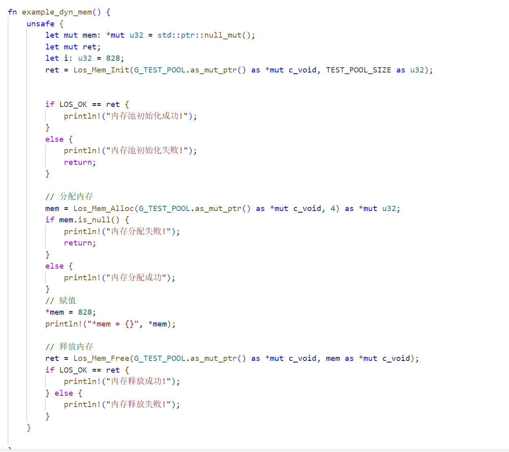
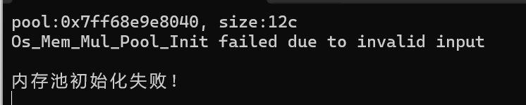
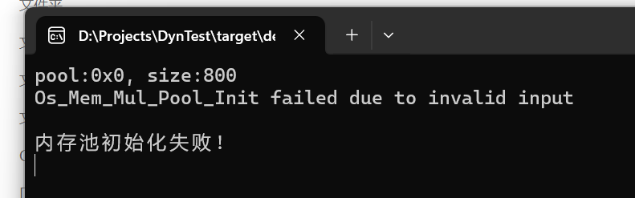
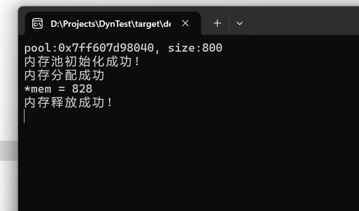
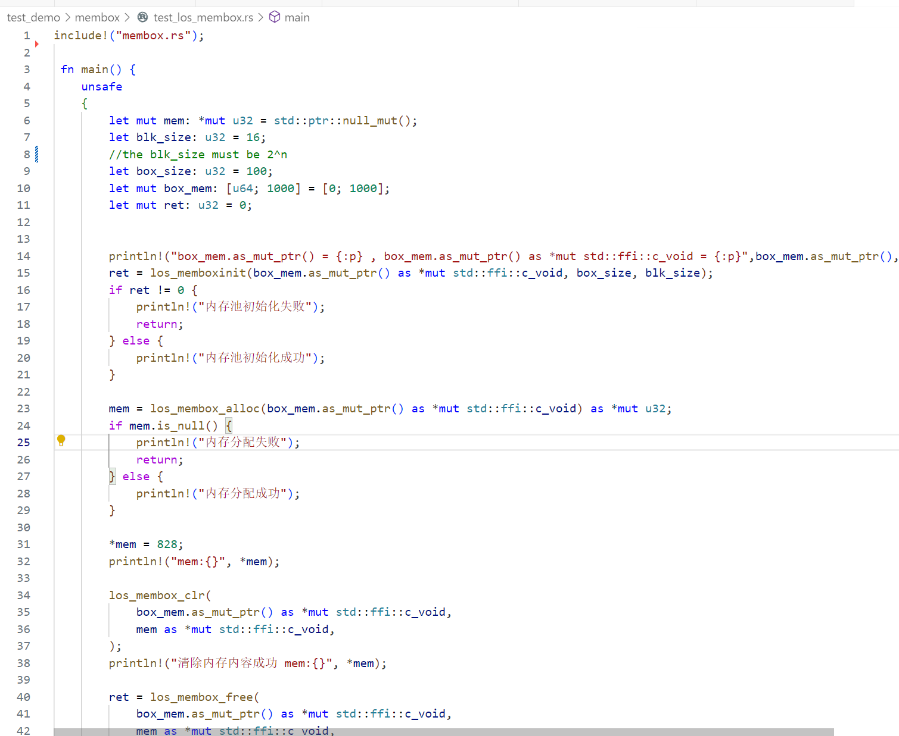
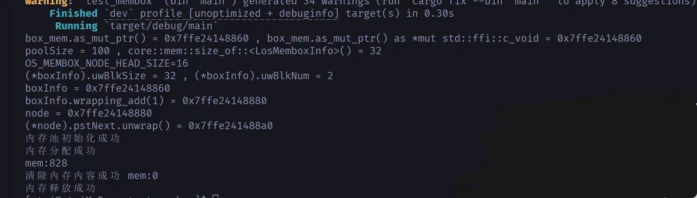

## 动态内存和静态内存的功能测试与分析
### 动态内存的功能测试与分析
#### 动态内存测试文件
我们使用的动态内存测试文件如下：

+ 该测试实例首先调用 `Los_Mem_Init(g_testPool, TEST_POOL_SIZE)` 初始化一个名为` g_testPool `的内存池，大小为` TEST_POOL_SIZE`。
+ 如果初始化成功 `(LOS_OK == ret)`，则输出 "内存池初始化成功!"。如果初始化失败，则输出 "内存池初始化失败!" 并退出函数。
+ 然后该实例使用 `Los_Mem_Alloc(g_testPool, 4)` 从内存池 `g_testPool` 中分配 4 字节的内存。
+ 如果分配成功，将返回一个指向 UINT32 类型的指针 mem，指向分配的内存块，并输出 "内存分配成功"。如果分配失败（即 mem 为 NULL），则输出 "内存分配失败!" 并退出函数。
+ 然后将值 828 存储到 mem 指向的内存块中，即 `*mem = 828;`。使用 `dprintf` 函数输出存储在 mem 中的值，即 "*mem = 828\n"。
内存释放：
+ 最后调用 Los_Mem_Free(g_testPool, mem) 释放先前分配的内存块。如果释放成功（返回值为 LOS_OK），则输出 "内存释放成功!"。如果释放失败，则输出 "内存释放失败!"。
+ 最后函数结束并返回，处理完内存分配和释放的各种情况。

#### 动态内存测试结果
##### 测试失败案例
###### 失败案例一

由于内存池大小为`12c`(非法)，所以打印失败信息并返回。
###### 失败案例二

由于内存池起始地址为`0x0`(非法)，所以仍打印失败信息并返回。
##### 测试成功案例

当测试文件符合所有预期时，显示测试成功，并打印测试信息。

### 静态内存的功能测试与分析
#### 静态内存测试文件

+ 该实例首先声明一个大小为 1000 的 `box_mem` 数组，用作静态内存池。
+ 然后调用 `los_memboxinit(&box_mem[0], box_size, blk_size)` 对 `box_mem `进行初始化：
   + `&box_mem[0] `是内存池的起始地址。
   + `box_size `是内存池的总大小，这里为 100 个单位。
   + `blk_size` 是每个内存块的大小，这里为 10 个单位。
+ 如果初始化失败（`ret != LOS_OK`），则打印 "内存池初始化失败!" 并返回。如果初始化成功，则打印 "内存池初始化成功!" 继续执行。
+ 再使用` los_membox_alloc(box_mem)` 从静态内存池` box_mem` 中分配一个内存块。如果分配失败（`mem 为 NULL`），则打印 "内存分配失败!" 并返回。如果分配成功，则打印 "内存分配成功"。
+ 再将值 828 存储到 mem 指向的内存块中，即 `*mem = 828;`。使用 printf 函数输出存储在 mem 中的值，即 "`*mem = 828\n`"。
+ 清除内存内容：使用` los_membox_clr(box_mem, mem)` 清除 mem 指向的内存块内容。使用 `printf `函数确认清除操作成功，并输出` *mem `的值，即 "清除内存内容成功\n *mem = 828\n"。
+ 最后使用 `los_membox_free(box_mem, mem) `释放先前分配的内存块。如果释放成功（返回值为 `LOS_OK`），则打印 "内存释放成功!"。如果释放失败，则打印 "内存释放失败!"。

#### 静态内存测试结果

由图可知，静态内存初始化、分配和释放成功。
## 总结
### 创新点
+ 使用`Rust`语言的特性，如`Cell`和`ManuallyDrop`，来管理内存，利用`Cell`的内部可变性，有助于保持`Rust`的内存安全特性。
+ 条件编译特性与多平台特性的保持。如`#[cfg(feature = "LOSCFG_AARCH64")]`
+ 通过`link_reg`字段和相关的特性标志（`LOSCFG_MEM_LEAKCHECK`），保留了内存泄漏检测的功能。

### 存在的不足
+ 缺少错误处理与共享内存的并发安全性相关考虑，代码可读性与可维护性不够健壮。
+ 对所改写内存管理单元的性能测试略微缺少。

### 总结与展望
+ 首次分析Lite OS这种规模较大、完成度高的项目代码，提高了复杂任务的处理能力。
+ 通过对Rust语言的系统学习，体会到了其类型安全、并发安全的特性。
+ 加深了对系统级编程中的安全性、操作系统各部分的联系与优化设计的理解。

