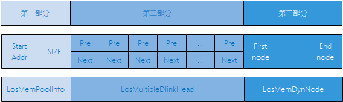
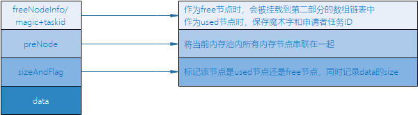
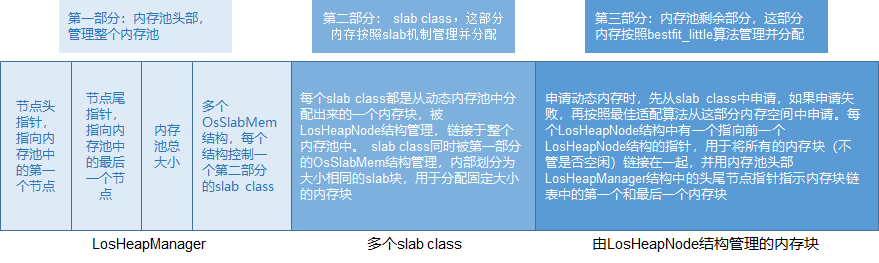
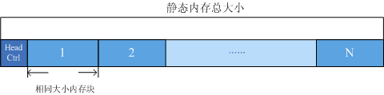

#### 项目背景

本项目旨在使用Rust改写LiteOS内核中的内存管理单元，提高其安全性。

LiteOS 是华为云提供的轻量级物联网操作系统，支持MMU和POSIX接口，适合物联网领域。Rust的接近底层、高性能、安全性使得它可以适于构建操作系统。Huawei LiteOS（下简称LiteOS）是华为面向IoT领域构建的轻量级物联网操作系统，可广泛应用于智能家居、个人穿戴、车联网、城市公共服务、制造业等领域。LiteOS遵循BSD-3开源许可协议， 目前已支持 ARM64、ARM Cortex-A、ARM Cortex-M0，Cortex-M3，Cortex-M4，Cortex-M7 等芯片架构。

Rust 是为了解决系统编程领域的安全性问题, 而设计的一门面向系统编程的安全可靠、性能出众的系统级编程语言，具有内存安全性和并发性等特性。作为一门系统级编程语言，Rust的性能与C/C++相差无几。近年来，由于其严格的所有权和借用规则，Rust逐渐受到操作系统开发者的青睐，在底层软件系统的构建中得到了越来越广泛的应用。

**高性能、无垃圾回收、零成本抽象、不依赖虚拟机**等特性保证了Rust的高效性。

**函数式编程范式、强多态类型系统、基于所有权模型的自动内存管理、对非安全代码的显式标记和隔离**等特性实现了Rust的类型安全、内存安全和并发安全。

这些特性使Rust可以在不显著降低性能的情况下获得严格的安全性，成为改写LiteOS、保障其安全性的理想选择。

#### 工作内容概述

我们使用Rust改写了LiteOS内核的内存管理单元部分，能够实现动态/静态内存管理，并通过测试。

内存管理单元的结构如下：

bestfit/bestfit_little: 基于最佳适配算法实现动态内存管理。
slab：实现了Slab分配器，对于内核对象和小内存块的管理更加高效。
common： 实现内存管理的通用功能。
memstat：统计内存使用量、空闲内存量等。
multipool：提供了多内存池的管理功能。
membox： 静态内存管理，固定大小的内存块分配

#### 内存管理机制简介

**内存管理单元（MMU）**

内存管理模块管理系统的内存资源，它是操作系统的核心模块之一，主要包括内存的初始化、分配以及释放。

内存管理单元（MMU）是处理器支持操作系统高效运行的基础，与软件内存管理模块相结合完成了虚拟地址到物理地址的转换。同时，MMU能够对处理器发出的地址进行合法性检验，在硬件上提供了内存访问授权控制。由于MMU与处理器体系结构高度相关，因此在不同的处理器下内存管理机制区别很大。

大多数的RTOS都是运行于单片机上，不支持MMU，内核空间和APP空间不能隔离开，APP出错后整个系统就会崩溃。LiteOS 支持 MMU，这意味着它可以实现内核空间和应用程序空间的隔离。这种隔离性能够确保应用程序出现问题时不会影响到整个系统，提高了系统的健壮性和稳定性。

为了限制应用访问内存空间的范围并给操作系统提供内存管理的灵活性，计算机硬件需要引入内存保护/映射/地址转换硬件机制，如 RISC-V 的基址-边界翻译和保护机制、x86 的分段机制、RISC-V/x86/ARM 都有的分页机制。如果在地址转换过程中，无法找到物理地址或访问权限有误，则处理器产生非法访问内存的异常错误。

在系统运行过程中，内存管理模块通过对内存的申请/释放来管理用户和OS对内存的使用，使内存的利用率和使用效率达到最优，同时最大限度地解决系统的内存碎片问题。

Huawei LiteOS的内存管理分为**静态内存管理**和**动态内存管理**，提供内存初始化、分配、释放等功能。

**动态内存**：在动态内存池中分配用户指定大小的内存块。

动态内存管理，即在内存资源充足的情况下，根据用户需求，从系统配置的一块比较大的连续内存（内存池，也是堆内存）中分配任意大小的内存块。当用户不需要该内存块时，又可以释放回系统供下一次使用。

优点：按需分配。
缺点：内存池中可能出现碎片。

LiteOS动态内存支持bestfit（也称为dlink）和bestfit_little两种内存管理算法。

**bestfit**

bestfit内存管理结构如下图所示：

 

- 第一部分

  堆内存（也称内存池）的起始地址及堆区域总大小。

- 第二部分

  本身是一个数组，每个元素是一个双向链表，所有free节点的控制头都会被分类挂在这个数组的双向链表中。

  假设内存允许的最小节点为2min字节，则数组的第一个双向链表存储的是所有size为2min<size< 2min+1的free节点，第二个双向链表存储的是所有size为2min+1<size< 2min+2的free节点，依次类推第n个双向链表存储的是所有size为2min+n-1<size< 2min+n的free节点。每次申请内存的时候，会从这个数组检索最合适大小的free节点以分配内存。每次释放内存时，会将该内存作为free节点存储至这个数组以便下次再使用。

- 第三部分

  占用内存池极大部分的空间，是用于存放各节点的实际区域。
  

LosMemDynNode结构体介绍图：

**bestfit_little**

bestfit_little算法是在最佳适配算法的基础上加入slab机制形成的算法。最佳适配算法使得每次分配内存时，都会选择内存池中最小最适合的内存块进行分配，而slab机制可以用于分配固定大小的内存块，从而减小产生内存碎片的可能性。

Huawei LiteOS内存管理中的slab机制支持配置slab class数目及每个class的最大空间。

现以内存池中共有4个slab class，每个slab class的最大空间为512字节为例说明slab机制。这4个slab class是从内存池中按照最佳适配算法分配出来的。第一个slab class被分为32个16字节的slab块，第二个slab class被分为16个32字节的slab块，第三个slab class被分为8个64字节的slab块，第四个slab class被分为4个128字节的slab块。

初始化内存模块时，首先初始化内存池，然后在初始化后的内存池中按照最佳适配算法申请4个slab class，再逐个按照slab内存管理机制初始化4个slab class。

每次申请内存时，先在满足申请大小的最佳slab class中申请（比如用户申请20字节内存，就在slab块大小为32字节的slab class中申请），如果申请成功，就将slab内存块整块返回给用户，释放时整块回收。需要注意的是，如果满足条件的slab class中已无可以分配的内存块，则从内存池中按照最佳适配算法申请，而不会继续从有着更大slab块空间的slab class中申请。释放内存时，先检查释放的内存块是否属于slab class，如果是则还回对应的slab class中，否则还回内存池中。

**静态内存**：在静态内存池中分配用户初始化时预设（固定）大小的内存块。

静态内存实质上是一个静态数组，静态内存池内的块大小在初始化时设定，初始化后块大小不可变更。
静态内存池由一个控制块和若干相同大小的内存块构成。控制块位于内存池头部，用于内存块管理。内存块的申请和释放以块大小为粒度。

优点：分配和释放效率高，静态内存池中无碎片。
缺点：只能申请到初始化预设大小的内存块，不能按需申请。 

  

LiteOS操作系统将内核与内存管理分开实现，操作系统内核仅规定了必要的内存管理函数原型，而不关心内存管理的函数是如何实现的，所以在LiteOS 中提供了多种内存分配算法（分配策略），但是上层接口（API）却是统一的。这样做可以增加系统的灵活性：用户可以选择对自己更有利的内存管理策略，在不同的应用场合使用不同的内存分配策略。

**中断管理**  LiteOS的中断具有如下特性：中断共享，且可配置，依赖链表实现；中断嵌套，即高优先级的中断可抢占低优先级的中断，GIC与NVIC的中断嵌套由硬件实现，RISC-V中的中断嵌套由中断栈实现；使用独立中断栈；可配置支持的中断优先级个数；可配置支持的中断数。

**异常接管**  异常接管是操作系统对运行期间发生的异常情况（芯片硬件异常）进行处理的一系列动作，例如打印异常发生时当前函数的调用栈信息、CPU现场信息、任务的堆栈情况等。LiteOS的异常接管，在系统发生异常时的处理动作为：显示异常发生时正在运行的任务信息（包括任务名、任务号、堆栈大小等），以及CPU现场等信息。针对某些RISC-V架构的芯片，对内存size要求较高的场景，LiteOS提供了极小特性宏，用于裁剪多余的异常提示字符串信息，但是仍然保留发生异常时的CPU执行环境的所有信息

