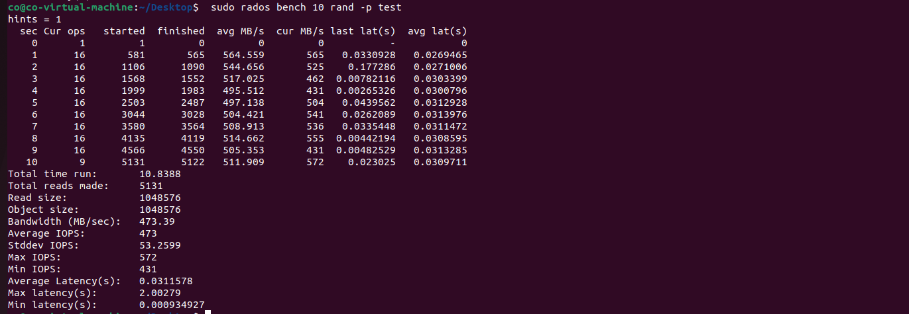
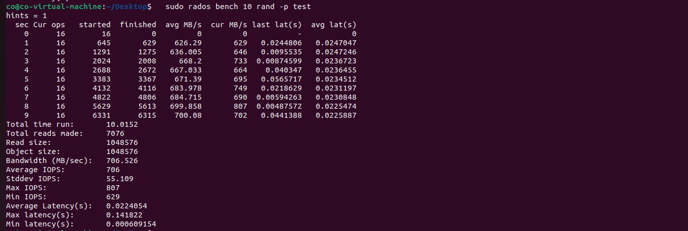

# Ceph单机性能测试文档

lab4 report 单机性能测试

### 评测指标的选取

- 读/写延迟：指发起 IO 请求到存储系统把 IO 处理完成的时间间隔。
  合理性：反映出存储系统反应的快慢。

- 读/写IOPS：每秒钟能处理的读写请求数量。
  合理性：IOPS直接反映存储系统处理高并发的能力，决定了存储系统服务的规模。

- 读/写吞吐率（带宽），即总大小/总时间。
  合理性：吞吐率反映处存储系统处理大规模数据的速度，即能够应对多少数据。

- 故障率：即服务不可用时间/总时间。
  合理性：故障率与服务的稳定性直接相连，服务不稳定会带来巨大的损失。

- 服务规模：即Ceph最大支持的主机数、硬盘数和存储容量。
  合理性：Ceph作为分布式存储的框架，需要支持超大规模的存储才能发挥其作用。

我们选择前3项指标，在顺序读、随机读、写三种情况下进行测试，以测试程序显示的Average Latency、Average IOPS、Bandwidth为准。

### 单机测试(优化前)

#### 测试环境

- Ubuntu 22.04.4 
- 4GB内存
- 2个单核处理器
- 四个SCSI硬盘，主硬盘30G用于安装Ubuntu系统本身和必要软件，三个8G新硬盘用于Ceph OSDS
- ip为`192.168.222.135`

#### 测试结果
我们使用 ceph 自带的`rados bench`进行测试，先创建一个名为`test`的`pool`。

##### 写测试 `rados bench 10 write -p test --no-cleanup -b 1M --no-cleanup` 三次

##### 顺序读测试 `rados bench 10 seq -p test ` 三次

##### 随机读测试 `rados bench 10 rand -p test ` 三次

##### 计算得三项指标的平均值如下
| 类型 | 延迟(ms) | IOPS  | 带宽(MB/s) |
| :--: | :------: | :---: | :--------: |
|  写  | 101.3138 | 157.3  | 157.648   |
|  顺序读  | 49.9069   | 318.7 |  319.107  |
|随机读 |28.6951|555.7|556.148|

### 单机测试(优化后)
为了改善性能，我们主要从数据分布，提升I/O性能，减少内存开销三个角度着手。
- 增大默认 PG（Placement Group）数量到 64 
- 禁用部分 in-memory logging，以减少内存开销
- 在ceph的dashboard中修改Recovery的优先级；减少一致性检查操作。
- 增大硬盘预读取值直至4096，请求队列加深至1024；可以提高顺序读取性能和并发 I/O 处理能力。
