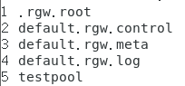
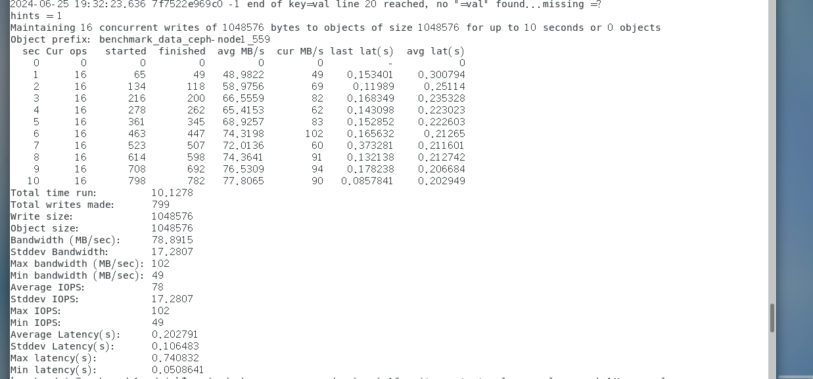
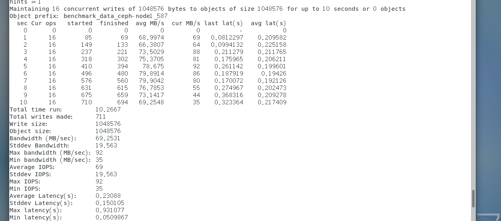
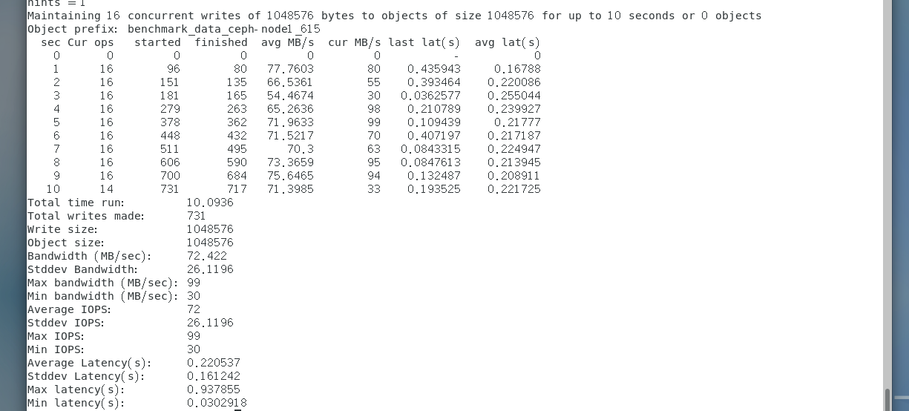
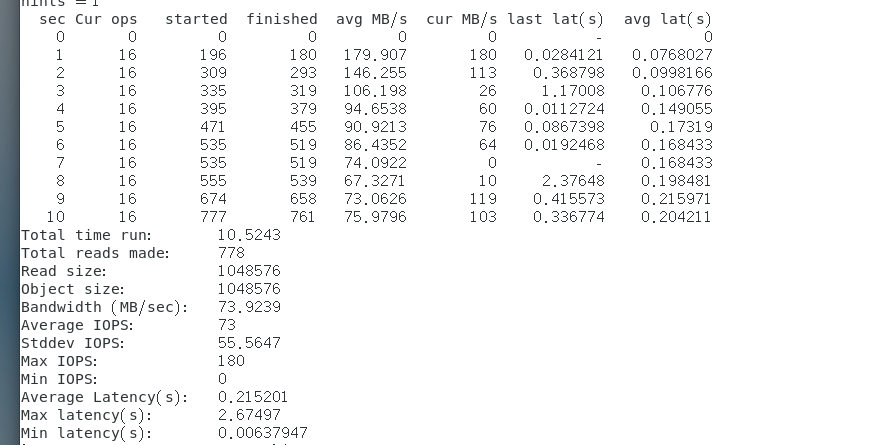
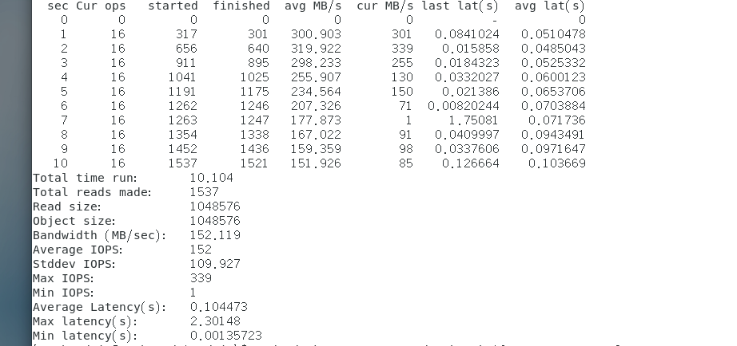
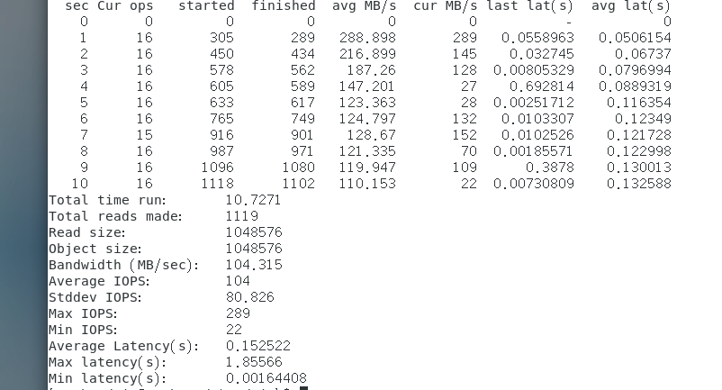
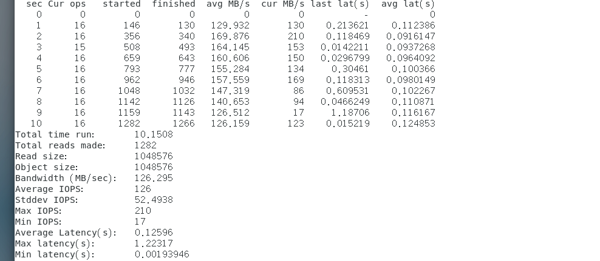
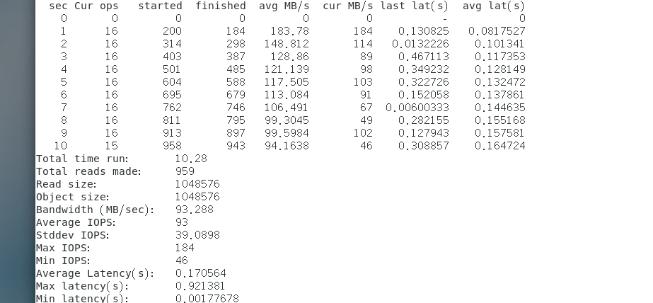
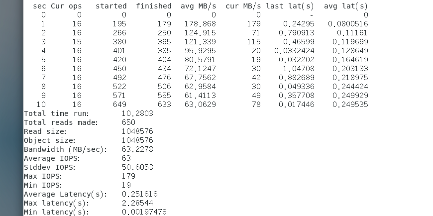

# Ceph多机性能测试文档

### 评测指标选取

评测指标与主要测试指标选取与单机部署情况相同， 可见 ./单机性能测试文档.md

### Docker分布式部署性能测试

#### 测试环境
见./部署文档.md中的Docker部署部分.

#### 测试内容

先创建一个名为"testpool"的pool: 
```bash
(sudo) docker exec mon ceph osd pool create testpool 64 64
```
查看创建结果, 使用:
```bash
(sudo) docker exec mon ceph osd lspools
```
结果如下:

分别测试其写, 随机读, 顺序读性能

#### 测试结果
- 测试写:
    ```bash
    sudo docker exec mon rados bench 10 write -p testpool --no-cleanup -b 1M --no-cleanup
    ```
    测试三次结果如下:
    
    
    

- 顺序读: 
  ```bash
  sudo docker exec mon rados bench 10 seq -p testpool
  ```
  测试三次,结果如下: 
    
    
    

- 随机读;
  ```bash
  sudo docker exec mon rados bench 10 rand -p testpool
  ```
  结果如下:
    
    
     

可得三项指标的平均值如下所示:
|读/写类型| 平均延迟(ms) | 带宽 | IOPS |
|:---| :---: | :---:| :---:|
|写 | 218 | 73.5222|73 |
|顺序读| 157.3 | 110.12 | 109.67|
|随机读| 182.7| 94.27 | 94|